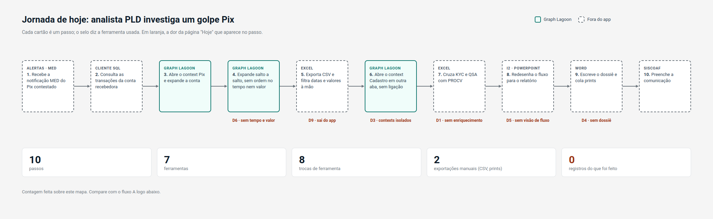
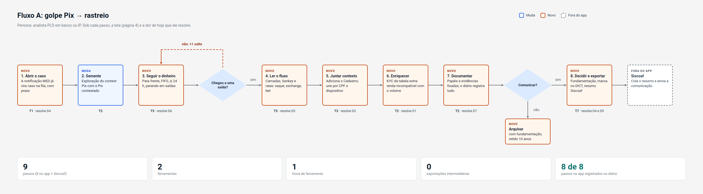
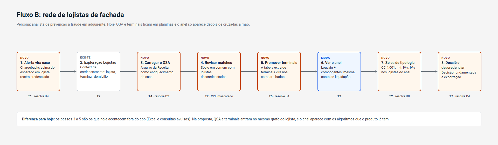
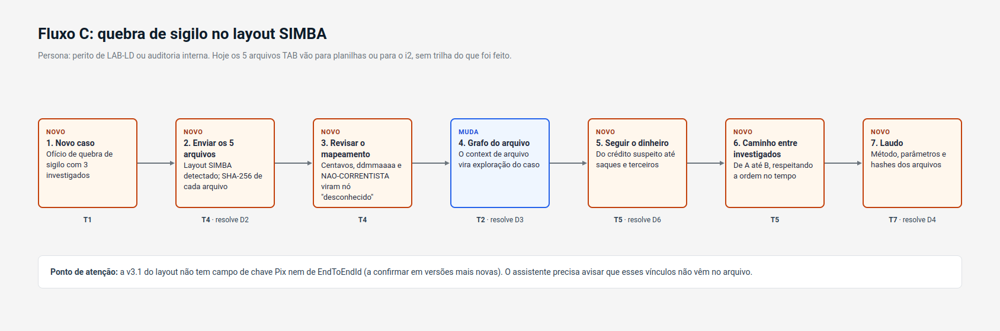
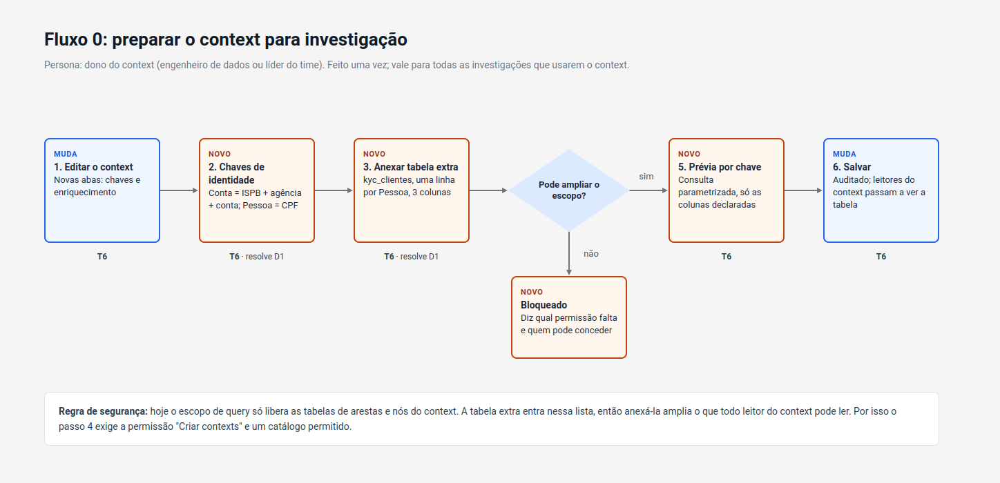
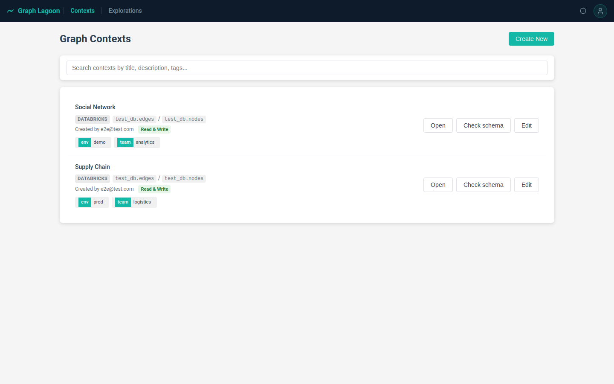
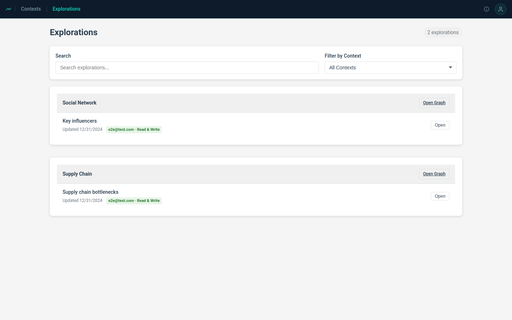
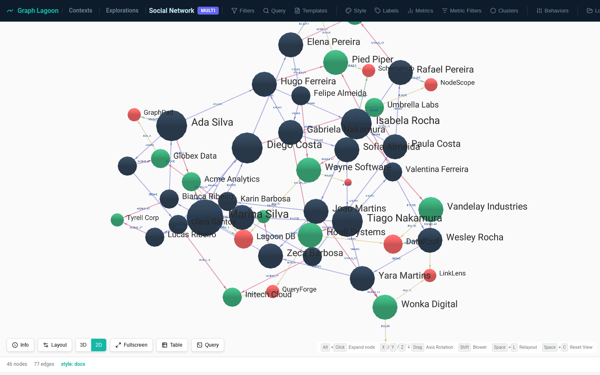
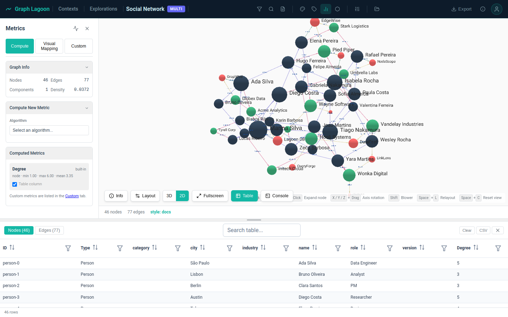
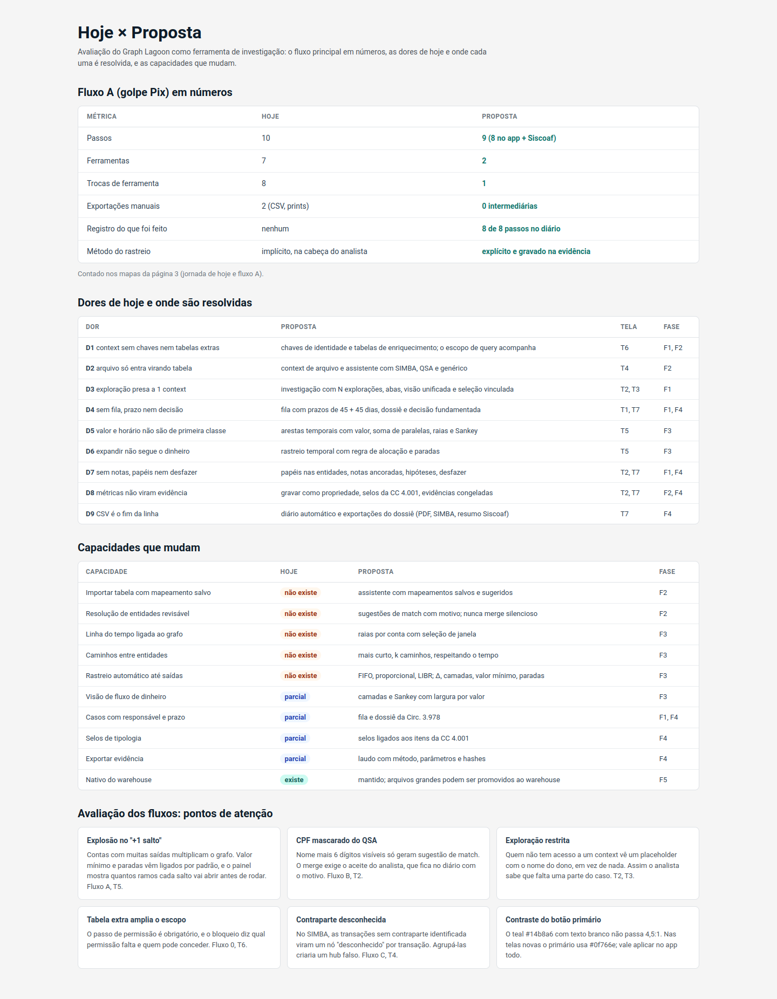

# 02 · Design

As imagens em `screens/` e `diagrams/` são o alvo visual. Os HTML-fonte estão em
`mockups/` e têm estilos inline com os valores exatos. Todos os dados das telas são
fictícios.

## Sistema visual

**Siga o app atual.** Os tokens vêm de `frontend/src/assets/main.css`:

| Uso | Valor |
|---|---|
| Barra superior | `#0d1b2a`, 52 px, texto `#c8e8f0`, link ativo `#14b8a6` |
| Superfícies | fundo `#f5f5f5`, painel `#ffffff`, canvas do grafo `#fafafa`, borda `#dee2e6` |
| Texto | `#2c3e50`; secundário `#6c757d` (nunca `#9ca3af` em texto) |
| Raios | 4, 6 e 8 px |
| Fonte | pilha do sistema; 13–14 px de base |
| **Botão primário** | **`#0f766e`** com texto branco. O `#14b8a6` com texto branco não passa 4,5:1; use-o só em bordas, ícones e foco |

**Codificação nova**, sempre com rótulo e nunca só cor:

| Canal | Significado | Valores |
|---|---|---|
| **Anel** do nó | Proveniência (fonte) | teal `#0f766e` = context Pix · roxo `#7c3aed` = Cadastro · âmbar `#b45309` = arquivo · ardósia `#475569` = outros. Nó unificado = anéis concêntricos |
| **Preenchimento** do nó | Papel no caso | azul `#2563eb` = vítima · laranja `#ea580c` = laranja ou suspeito · cinza = neutro ou descartado |
| **Forma** do nó | Classe | círculo = conta ou pessoa · quadrado navy `#0d1b2a` = saída (saque, exchange, aposta) · losango = dispositivo · nó "Desconhecido" = círculo tracejado cinza |
| **Largura** da aresta | Valor rastreado | proporcional ao valor |
| Destaque | Selecionado | halo `#14b8a6` |
| Status (fila) | Em análise / aguardando / comunicado / arquivado | azul / cinza / teal / contorno |
| Urgência | Prazo < 7 dias | texto e barra `#9a3412` / `#c2410c` |

## Telas

| ID | Tela | Imagem | Mockup | O que precisa ter |
|---|---|---|---|---|
| T1 | Fila de investigações | [png](screens/T1-Fila.png) | [html](mockups/T1-Fila.dc.html) | filtros (busca por caso, CPF/CNPJ, conta, chave Pix; status; tipologia; responsável); contadores; tabela com caso, tipologia, fontes (pontos de proveniência), status, responsável, prazo (barra), atualizado |
| T2 | Workspace | [png](screens/T2-Workspace.png) | [html](mockups/T2-Workspace.dc.html) | abas por exploração + "Visão unificada" + restrita (cadeado) + "Adicionar"; painel de fontes (explorações, arquivos, unificação, botão de matches); canvas com legenda (anel e papel); botões flutuantes como hoje + "Seguir o dinheiro"; inspector com papel, abas Dados / Enriquecimento / Notas / Origem; rodapé com contagens e diário |
| T3 | Adicionar ao caso | [png](screens/T3-Adicionar.png) | [html](mockups/T3-Adicionar.dc.html) | modal; abas Explorações / Arquivo / Query Console; lista por context (já no caso, selecionável, restrita); prévia da união (sobreposição, novos, chaves usadas, conflitos); viva × congelar |
| T4 | Assistente de arquivo | [png](screens/T4-Arquivo.png) | [html](mockups/T4-Arquivo.dc.html) | passos 1–5; layout detectado com arquivos e hash; tabela coluna → papel → conversão; prévia de arestas; qualidade; salvar mapeamento; cadeia de custódia |
| T5 | Seguir o dinheiro | [camadas](screens/T5-Rastreio.png) · [Sankey](screens/T5-Rastreio-Sankey.png) | [html](mockups/T5-Rastreio.dc.html) | parâmetros (semente, direção, camadas, Δ, valor mínimo, janela, regra de alocação, paradas); alternância Camadas/Sankey; chips de totais; raias no tempo; saídas com valores por regra; retidos; carimbo do método; "Levar para o dossiê" |
| T6 | Context: chaves e enriquecimento | [png](screens/T6-Context.png) | [html](mockups/T6-Context.dc.html) | abas novas "Chaves de identidade" e "Enriquecimento"; aviso de escopo; tabelas anexadas; formulário de anexar (tabela, chave, cardinalidade, colunas, prévia, nome) |
| T7 | Dossiê e decisão | [png](screens/T7-Dossie.png) | [html](mockups/T7-Dossie.dc.html) | resumo com selos CC 4.001; hipóteses (status, a favor, contra); evidências congeladas com hash; diário; painel de decisão (resultado, ações, fundamentação, aviso de tipping-off, exportações, registrar) |
| T8 | Revisão de matches | [png](screens/T8-Matches.png) | [html](mockups/T8-Matches.dc.html) | fila de sugestões ordenada por impacto; comparação lado a lado com os trechos coincidentes destacados; motivos; efeito de aceitar; motivo da decisão; aceitar / recusar / adiar |
| T9 | Anel de lojistas | [png](screens/T9-Anel.png) | [html](mockups/T9-Anel.dc.html) | selos de tipologia clicáveis; layout bipartido lojistas × elementos compartilhados; painel da comunidade com números e ações |

### Direções de layout

Três estruturas foram exploradas. **Recomendação: A**, com o T5 funcionando como
cockpit (B) durante o rastreio. A decisão final é a Q1 do [README](README.md#decisões-em-aberto-precisam-de-humano).

| Direção | Imagem | A favor | Contra |
|---|---|---|---|
| A · Canvas-first | [png](screens/Dir-A-Canvas.png) | é o app de hoje com painéis a mais; menor custo e curva | timeline e Sankey ficam secundários |
| B · Cockpit | [png](screens/Dir-B-Cockpit.png) | grafo, Sankey, raias e transações sincronizados | exige tela grande e seleção compartilhada nova |
| C · Dossiê-first | [png](screens/Dir-C-Dossie.png) | o caso nasce como documento | menos espaço de exploração |

## Fluxos de usuário

Os fluxos são **o roteiro dos testes E2E** e das jornadas em
`e2e/tests/user-journeys.spec.ts`. Em cada passo, "status" diz se a peça já existe,
muda ou é nova.

### Jornada de hoje: golpe Pix

| # | Ferramenta | Passo |
|---|---|---|
| 1 | Alertas / MED | Recebe a notificação MED do Pix contestado |
| 2 | Cliente SQL | Consulta as transações da conta recebedora |
| 3 | Graph Lagoon | Abre o context Pix e expande a conta |
| 4 | Graph Lagoon | Expande salto a salto, sem ordem no tempo nem valor (D6) |
| 5 | Excel | Exporta CSV e filtra datas e valores à mão (D9) |
| 6 | Graph Lagoon | Abre o context Cadastro em outra aba, sem ligação (D3) |
| 7 | Excel | Cruza KYC e QSA com PROCV (D1) |
| 8 | i2 / PowerPoint | Redesenha o fluxo para o relatório (D5) |
| 9 | Word | Escreve o dossiê e cola prints (D4) |
| 10 | Siscoaf | Preenche a comunicação |

Contagem: 10 passos, 7 ferramentas, 8 trocas de ferramenta, 2 exportações manuais, 0
registro do que foi feito.

### Fluxo A: golpe Pix → rastreio (analista PLD, banco ou IP)

| # | Passo | Tela | Status | Resolve |
|---|---|---|---|---|
| 1 | A notificação MED vira caso na fila, com prazo | T1 | novo | D4 |
| 2 | Semente: exploração do context Pix com o Pix contestado | T2 | muda | |
| 3 | Seguir o dinheiro: para frente, FIFO, Δ 24 h, paradas | T5 | novo | D6 |
| — | Decisão "chegou a uma saída?": se não, "+1 salto" volta ao passo 3 | T5 | novo | |
| 4 | Ler o fluxo: camadas, Sankey, raias | T5 | novo | D5 |
| 5 | Juntar contexts: adiciona o Cadastro e une por CPF e dispositivo | T3 | novo | D3 |
| 6 | Enriquecer: KYC da tabela extra mostra renda incompatível | T2 | novo | D1 |
| 7 | Documentar: papéis, evidências fixadas, diário | T2 | novo | D7 |
| — | Decisão "comunicar?": se não, arquivar com fundamentação | T7 | novo | |
| 8 | Decidir e exportar: fundamentação, marca no DICT, resumo Siscoaf | T7 | novo | D4, D9 |
| 9 | Siscoaf (fora do app): colar e enviar | — | fora | |

Contagem: 9 passos (8 no app), 2 ferramentas, 1 troca, 0 exportações intermediárias,
8 de 8 passos no diário.

### Fluxo B: rede de lojistas de fachada (analista de adquirente)

| # | Passo | Tela | Status |
|---|---|---|---|
| 1 | Alerta de chargebacks em lojista recém-credenciado vira caso | T1 | novo |
| 2 | Exploração do context de credenciamento (lojista, terminal, domicílio) | T2 | existe |
| 3 | Carregar o QSA da Receita como enriquecimento | T4 | novo |
| 4 | Revisar matches: sócia em comum com lojistas descredenciados | T8 | novo |
| 5 | Promover terminais (tabela extra) a nós compartilhados | T6, T2 | novo |
| 6 | Ver o anel: Louvain + componentes, mesma conta de liquidação | T9 | muda |
| 7 | Selos de tipologia: CC 4.001 III-f, IV-v a IV-z | T9 | novo |
| 8 | Dossiê e descredenciamento | T7 | novo |

### Fluxo C: quebra de sigilo SIMBA (perito ou auditoria)

| # | Passo | Tela | Status |
|---|---|---|---|
| 1 | Novo caso a partir do ofício | T1 | novo |
| 2 | Enviar os 5 arquivos; layout detectado; hash de cada um | T4 | novo |
| 3 | Revisar o mapeamento: centavos, datas, NAO-CORRENTISTA vira nó "Desconhecido" | T4 | novo |
| 4 | O grafo do arquivo vira exploração do caso | T2 | muda |
| 5 | Seguir o dinheiro | T5 | novo |
| 6 | Caminho que respeita o tempo entre investigados | T5 | novo |
| 7 | Laudo com método, parâmetros e hashes | T7 | novo |

### Fluxo 0: preparar o context (dono do context)

| # | Passo | Tela | Status |
|---|---|---|---|
| 1 | Editar o context | T6 | muda |
| 2 | Declarar chaves de identidade (Conta = banco + agência + conta; Pessoa = CPF) | T6 | novo |
| 3 | Anexar uma tabela extra (ex.: `kyc_clientes`, uma linha por Pessoa) | T6 | novo |
| — | Decisão "pode ampliar o escopo?" (`context.create` + catálogo permitido); se não, bloqueado com a permissão que falta e quem pode conceder | T6 | novo |
| 5 | Prévia por chave (consulta parametrizada, só colunas declaradas) | T6 | novo |
| 6 | Salvar (auditado) | T6 | muda |

## Hoje: telas atuais e dores

| Tela atual | Dores |
|---|---|
|  | **D1:** um context é uma tabela de arestas e uma de nós; não há chaves de identidade nem tabelas extras. **D2:** arquivo só entra virando tabela no warehouse |
|  | **D3:** a exploração é presa a um context; não dá para juntar Pix, Cadastro e Cartões. **D4:** sem status, responsável, prazo ou decisão |
|  | **D5:** valor e horário não são dimensões; arestas paralelas são contadas e não somadas; sem timeline. **D6:** expandir não segue o dinheiro no tempo. **D7:** sem notas, papéis ou desfazer |
|  | **D8:** valores calculados não viram propriedade nem evidência. **D9:** o CSV é o fim da linha |

**O que já ajuda e deve ser reaproveitado:**
- o filtro no warehouse antes de renderizar;
- as métricas customizadas em sandbox;
- grupos e permissões com auditoria;
- Louvain, centralidades, ego e o hierárquico "money flow".

## Avaliação: hoje × proposta

**Pontos de atenção** que o design já trata e a implementação precisa manter:
- **Explosão no "+1 salto":** valor mínimo e paradas vêm ligados por padrão, e o
  painel mostra quantos ramos o próximo salto abre.
- **CPF mascarado:** só gera sugestão de match; o merge exige aceite com motivo.
- **Exploração restrita:** aparece como placeholder com o dono, nunca some.
- **Anexar tabela amplia o escopo:** o bloqueio diz qual permissão falta e quem pode
  conceder.
- **Contraparte desconhecida do SIMBA:** um nó por transação; agrupar criaria um hub
  falso.
