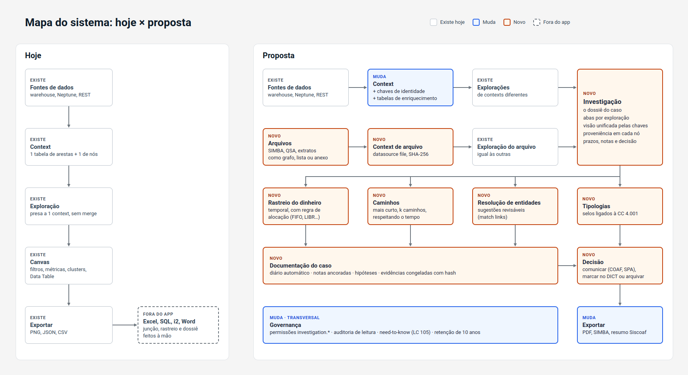
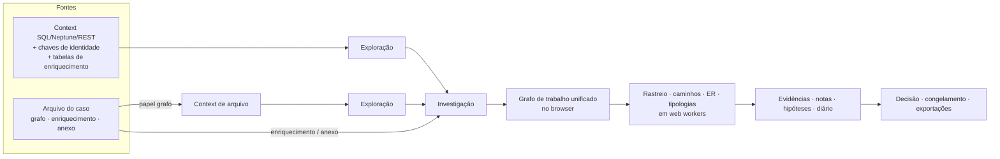

# 03 · Arquitetura

Este documento diz **como** construir o que o [plano](04-plano-de-implementacao.md)
pede. Onde ele fixa uma forma (nome de campo, rota, algoritmo), siga-a; se precisar
mudar, registre o motivo no decision log.

## 1. Visão geral





Princípios:
- **A exploração não muda.** Continua com FK para um context. A investigação só a
  referencia.
- **O grafo de trabalho vive no browser,** no `stores/graph.ts` existente. O
  servidor guarda fontes, arquivos brutos, eventos e evidências.
- **Algoritmos interativos rodam em web worker,** como os de métricas hoje. Versões
  em SQL ficam para a F5.
- **Tudo que vira prova é imutável e tem hash:** arquivos, fontes congeladas,
  evidências e o caso decidido.

## 2. Modelo de dados

Postgres em `api/graphlagoon/db/models.py`, com migração
`api/graphlagoon/alembic/versions/016_investigations.py` e paridade em
`api/graphlagoon/db/memory_store.py`.

### 2.1 Colunas novas em `graph_contexts`

| Coluna | Tipo | Padrão | Forma |
|---|---|---|---|
| `identity_keys` | JSON | `[]` | lista de `IdentityKey` |
| `enrichment_tables` | JSON | `[]` | lista de `EnrichmentTable` |
| `edge_semantics` | JSON | `{}` | `EdgeSemantics` |

```python
class IdentityKey(BaseModel):
    node_type: str                     # tipo de nó do context
    entity: str                        # rótulo do conceito real: "Pessoa", "Conta", "Dispositivo"
    source: Literal["node_id"] | PropRef   # de onde vem o valor; PropRef = {"kind": "prop", "name": "..."}
    normalize: Literal["cpf_cnpj", "account", "phone", "email", "lower", "none"] = "none"

class EnrichmentTable(BaseModel):
    name: str                          # slug ^[a-z][a-z0-9_]{0,40}$, único no context
    label: str                         # nome no inspector
    table: str                         # catalog.schema.table, validado por sql_identifiers
    key_column: str
    match_node_types: list[str]        # tipos de nó que consultam esta tabela
    match_source: Literal["node_id"] | PropRef
    cardinality: Literal["one", "many"]
    columns: list[str]                 # 1..50; só estas saem na consulta
    promote: Optional[PromoteSpec] = None  # {"node_type": "Dispositivo", "id_column": "device_id", "edge_type": "USOU"}

class EdgeSemantics(BaseModel):
    amount_prop: Optional[str] = None
    amount_unit: Literal["units", "cents"] = "units"
    time_prop: Optional[str] = None
    currency: str = "BRL"
```

**Normalizadores**, os mesmos em `utils/identityKeys.ts` e no Python:
- `cpf_cnpj`: só dígitos. Um valor mascarado (`***.418.207-**`) **não** vira chave
  de identidade; vai para a resolução de entidades (§6.2).
- `account`: `banco-agência-conta`, só dígitos, sem zeros à esquerda em cada parte.
- `phone`: só dígitos, sem o DDI 55.
- `email`: minúsculas e trim.

A chave final de um nó é `"{entity}:{valor normalizado}"`.

### 2.2 Tabelas novas

| Tabela | Colunas principais | Notas |
|---|---|---|
| `investigations` | `id` UUID, `title`, `description`, `owner_email`, `assignee_email?`, `status` (`selecao`, `analise`, `decidido`, `arquivado`), `typology?`, `origin?` (`notificacao_med`, `oficio`, `monitoramento`, …), `selected_at?`, `state` JSON, `decision` JSON?, `frozen_hash?`, `frozen_at?`, `created_at`, `updated_at` | `state` guarda papéis `{entityKey: role}`, pins, `hypotheses[]` e preferências de vista |
| `investigation_shares` | `id`, `investigation_id` (cascade), `shared_with_email`, `permission` (`read`, `write`), `created_at` | **Só e-mail nominal**; curinga recusado |
| `investigation_sources` | `id`, `investigation_id`, `kind` (`exploration`, `file`), `exploration_id?` (SET NULL), `file_id?`, `context_id`, `mode` (`live`, `frozen`), `frozen_blob_key?`, `frozen_sha256?`, `title_snapshot`, `added_by`, `added_at`, `position` | `context_id` desnormalizado para checar acesso; `title_snapshot` é o que aparece quando a fonte é restrita |
| `investigation_files` | `id`, `investigation_id`, `filename`, `role` (`graph`, `enrichment`, `attachment`), `sha256`, `size_bytes`, `content_type`, `blob_key`, `mapping` JSON?, `context_id?`, `uploaded_by`, `uploaded_at` | `blob_key = investigations/{id}/files/{sha256}` |
| `investigation_events` | `id`, `investigation_id`, `at`, `actor_email`, `kind`, `payload` JSON (≤ 16 KB), `prev_hash`, `hash` | Diário imutável e encadeado: `hash = sha256(prev_hash + json canônico)` |
| `investigation_notes` | `id`, `investigation_id`, `anchor` JSON (`{kind: node, edge, evidence ou none, id}`), `body`, `author_email`, `created_at`, `updated_at` | |
| `investigation_evidence` | `id`, `investigation_id`, `title`, `kind` (`graph_state`, `trace`, `table`, `file`), `blob_key`, `sha256`, `params` JSON, `created_by`, `created_at` | Imutável |
| `entity_matches` | `id`, `investigation_id`, `left` JSON `{source_id, node_id, entity_key?}`, `right` JSON, `score`, `reasons` JSON, `status` (`sugerido`, `aceito`, `recusado`, `adiado`), `reason_text?`, `decided_by?`, `decided_at?`, `created_at` | |

`decision` = `{outcome: "comunicar" | "arquivar", actions: ["dict", "spa", "bloqueio_cautelar"], rationale, decided_by, decided_at}`.

## 3. API

Router novo `api/graphlagoon/routers/investigations.py`, prefixo `/api/investigations`.
As regras de acesso estão em §7.

### 3.1 Investigações

| Método e rota | Gate | Corpo / resposta |
|---|---|---|
| `GET /api/investigations?status=&assignee=&typology=` | leitura | lista com prazos calculados (§3.5) |
| `POST /api/investigations` | `investigation.create` | `{title, description?, typology?, origin?, assignee_email?}` → 201 |
| `GET /api/investigations/{id}` | leitura | caso completo, sem fontes |
| `PATCH /api/investigations/{id}` | escrita; recusado após decisão | `{title?, description?, status?, assignee_email?, typology?, state?}` |
| `DELETE /api/investigations/{id}` | dono ou superuser; 409 após decisão (superuser: `?reason=` obrigatório) | auditado |
| `POST /api/investigations/{id}/share` | dono | `{email, permission}`; `*` e `*@` levam 422 |
| `DELETE /api/investigations/{id}/share/{email}` | dono | auditado |

### 3.2 Fontes

| Método e rota | Gate | Notas |
|---|---|---|
| `GET /api/investigations/{id}/sources` | leitura | cada item tem `accessible: bool`; se for `false`, só vêm `title_snapshot`, o nome do context e o dono |
| `POST /api/investigations/{id}/sources` | escrita + leitura na exploração e no context | `{kind:"exploration", exploration_id, mode}`; `frozen` copia o snapshot com sha256 |
| `DELETE /api/investigations/{id}/sources/{sid}` | escrita | |
| `GET /api/investigations/{id}/sources/{sid}/snapshot` | leitura + acesso ao context | snapshot congelado ou o vivo da exploração |

### 3.3 Arquivos

| Método e rota | Gate | Notas |
|---|---|---|
| `POST /api/investigations/{id}/files` (multipart: `file`, `role`) | `investigation.upload` + escrita | sha256 no servidor; limite `investigation_file_max_bytes` (413) |
| `GET /api/investigations/{id}/files` | leitura | |
| `GET /api/investigations/{id}/files/{fid}/content` | leitura | auditado (leitura sigilosa) |
| `POST /api/investigations/{id}/files/{fid}/context` | escrita | `{mapping}` (§4) → o servidor gera o grafo, cria o context `file` e a exploração, e adiciona a fonte |

### 3.4 Diário (eventos)

`GET /api/investigations/{id}/events?after=&limit=` e
`POST /api/investigations/{id}/events` (só para eventos que nascem no cliente).

Tipos de evento (`kind`):

| Gerado pelo servidor | Gerado pelo cliente |
|---|---|
| `case.created`, `case.updated`, `case.shared`, `source.added`, `source.removed`, `file.uploaded`, `file.read`, `evidence.created`, `match.decided`, `decision.recorded`, `enrichment.read`, `export.created` | `trace.run` (payload = parâmetros + totais), `path.run`, `typology.accepted`, `nodes.promoted`, `metric.saved`, `role.changed` |

Eventos são imutáveis (nenhum `PUT` ou `DELETE`). O cliente nunca envia `hash` nem
`prev_hash`; o servidor calcula.

### 3.5 Notas, evidências, matches, decisão, exportação

- `GET/POST/PATCH/DELETE .../notes`: o `DELETE` é do autor; tudo vira evento.
- `POST .../evidence` com `{title, kind, params, snapshot}` (gz no servidor + sha256).
  `GET .../evidence` lista; `GET .../evidence/{eid}` devolve o conteúdo.
- `GET/POST .../matches`, `PATCH .../matches/{mid}` com `{status, reason_text}`.
- `POST .../decision` com `{outcome, actions, rationale}`. Congela as fontes vivas,
  calcula o `frozen_hash` e torna o caso só-leitura.
- `GET .../export?format=json|csv|simba|siscoaf` (`investigation.export`, auditado).
  O laudo PDF é a impressão (CSS print) da tela do dossiê.

**Prazos (F4.4):**
- `selection_due = created_at + 45 d`;
- `analysis_due = selected_at + 45 d`;
- `urgent = due − hoje < 7 d`.

### 3.6 Enriquecimento do context

`POST /api/graph-contexts/{id}/enrichment/{name}/lookup` com `{keys: [..]}`:
- até `enrichment_max_keys` chaves;
- devolve `{rows: [{key, values: {coluna: valor}}]}` só com `columns` declaradas;
- leitura no context basta;
- auditado como `enrichment.read`.

A query é montada no servidor:

```sql
SELECT <key_column>, <columns…> FROM <table> WHERE <key_column> IN (?, ?, …) LIMIT <n>
```

Identificadores passam por `services/sql_identifiers.py` e valores por parâmetro.
Nunca há SQL vindo do cliente.

## 4. Especificação de mapeamento de arquivo

Uma spec JSON declarativa, interpretada **igual** em TS (`utils/fileMapping.ts`, para
prévia) e em Python (`services/file_mapping.py`, autoritativo). As fixtures douradas
ficam em `frontend/src/__tests__/fixtures/fileMapping/`.

```jsonc
{
  "version": 1,
  "name": "SIMBA v3.1",
  "inputs": {                              // um ou mais arquivos
    "extrato":  {"match": "*_EXTRATO.TXT", "delimiter": "\t", "encoding": "latin-1", "header": true},
    "od":       {"match": "*_ORIGEM_DESTINO.TXT", "delimiter": "\t", "encoding": "latin-1", "header": true}
  },
  "joins": [{"left": "extrato.CODIGO_CHAVE_EXTRATO", "right": "od.CODIGO_CHAVE_EXTRATO", "as": "lanc"}],
  "nodes": [
    {"key": "conta", "type": "Conta", "from": "lanc",
     "id": {"concat": ["extrato.NUMERO_BANCO", "extrato.NUMERO_AGENCIA", "extrato.NUMERO_CONTA"], "normalize": "account"}},
    {"key": "pessoa", "type": "Pessoa", "from": "lanc", "when": {"ne": ["od.NUMERO_AGENCIA_OD", "9999"]},
     "id": {"col": "od.CPF_CNPJ_OD", "normalize": "cpf_cnpj"}, "props": {"nome": "od.NOME_PESSOA_OD"}},
    {"key": "desconhecido", "type": "Desconhecido", "from": "lanc", "when": {"eq": ["od.NUMERO_AGENCIA_OD", "9999"]},
     "id": {"template": "desconhecido:{od.CODIGO_CHAVE_OD}"}}
  ],
  "edges": [
    {"from": "lanc", "id": {"col": "od.CODIGO_CHAVE_OD"},
     "type": {"col": "extrato.TIPO_LANCAMENTO", "map": "simba_tipo_lancamento"},
     "direction": {"col": "extrato.NATUREZA", "C": "in", "D": "out"},   // in: contraparte → conta
     "endpoints": {"self": "conta", "other": ["pessoa", "desconhecido"]},
     "props": {"valor": {"col": "od.VALOR_TRANSACAO", "convert": "cents"},
               "data":  {"col": "extrato.DATA_LANCAMENTO", "convert": "date:ddmmyyyy"},
               "descricao": "extrato.DESCRICAO"}}
  ],
  "edge_semantics": {"amount_prop": "valor", "time_prop": "data", "currency": "BRL"},
  "tables": {"simba_tipo_lancamento": {"120": "TRANSF_INTERBANCARIA", "114": "SAQUE", "220": "DEPOSITO_ESPECIE"}}
}
```

**Operadores e conversores**, o conjunto fechado que os dois interpretadores
implementam:
- `when`: `eq`, `ne`, `in`, `empty`, `not_empty`;
- `id`: `col`, `concat`, `template`;
- `convert`: `cents`, `decimal_br` (`1.234,56`), `date:<fmt>`, `trim`, `upper`,
  `digits`;
- `map`: busca em `tables`;
- `normalize`: os normalizadores de §2.1.

Qualquer operador desconhecido é **erro de validação**, nunca ignorado.

**Relatório de qualidade**, devolvido junto da prévia e da geração:
- linhas lidas e descartadas, com o motivo (ex.: data inválida);
- quantidade de nós "Desconhecido";
- percentual de transações sem contraparte;
- campos ausentes no layout.

## 5. Frontend

### 5.1 Unificação do grafo

Função pura `unifyGraph(sources, contexts): UnifiedGraph` em `src/utils/unifyGraph.ts`:

```ts
for (const s of sources) {                       // explorações e contexts de arquivo do caso
  const ctx = contexts[s.contextId];
  for (const n of s.nodes) {
    const key = identityKeyOf(ctx, n);           // "Pessoa:12345678901" | null
    const uid = key ?? `${ctx.id}:${n.node_id}`;
    U.nodes[uid] = mergeNode(U.nodes[uid], n, { sourceId: s.id, contextId: ctx.id, nodeId: n.node_id });
  }
  for (const e of s.edges) {                     // arestas NUNCA são fundidas entre fontes
    U.edges[`${s.id}:${e.edge_id}`] = { ...e, src: uidOf(s, e.src), dst: uidOf(s, e.dst), __source: s.id };
  }
}
```

- **`mergeNode`:** acumula `__sources[]`. Propriedade igual fica uma vez; diferente
  fica com o primeiro valor e `__conflicts[prop] = [{value, sourceId}]`, mostrado no
  inspector (aba Origem). Tipo de nó diferente segue a mesma regra.
- **Expandir um nó unificado:** escolher uma entrada de `__sources`, chamar a expansão
  existente com aquele `contextId` e `nodeId`, e unificar o resultado como uma fonte
  `expansion:<sourceId>`.
- **Papéis e pins:** guardados em `investigations.state` por `uid`.

### 5.2 Rotas, stores e componentes

| Peça | Arquivo | Tela |
|---|---|---|
| Rotas | `src/router/index.ts`: `/investigations`, `/investigations/:id`, `/investigations/:id/dossie`, `/investigations/:id/matches` | |
| Tipos | `src/types/investigation.ts` | |
| API | `src/services/api.ts` | |
| Stores | `src/stores/investigation.ts` (caso, fontes, arquivos, eventos, estado), `src/stores/trace.ts` (parâmetros, resultado) | |
| Fila | `src/views/InvestigationsView.vue` | T1 |
| Workspace | `src/views/InvestigationView.vue` + `components/investigation/SourcesPanel.vue`, `EnrichmentTab.vue` | T2 |
| Adicionar | `components/investigation/AddToInvestigationModal.vue` | T3 |
| Arquivo | `components/investigation/FileImportWizard.vue` | T4 |
| Rastreio | `components/investigation/TracePanel.vue`, `TraceSankey.vue`, `SwimlaneTimeline.vue` | T5 |
| Context | abas novas em `components/GraphContextFormModal.vue` | T6 |
| Dossiê | `src/views/InvestigationDossierView.vue` | T7 |
| Matches | `src/views/InvestigationMatchesView.vue` | T8 |
| Tipologias | `components/investigation/TypologyBadgesPanel.vue` | T9 |
| Workers | `src/workers/traceWorker.ts`, `pathWorker.ts`, `erWorker.ts` (padrão de `metricsWorker.ts` + `services/workerPool.ts`) | |
| Layout | `trace-layers` em `utils/layoutModes.ts` e `LAYOUT_ALGORITHMS` (`types/graph.ts`) | T5 |
| Aparência | anéis de proveniência e papéis em `utils/graphAppearance.ts` | T2 |

## 6. Algoritmos

### 6.1 Rastreio temporal (seguir o dinheiro)

Núcleo puro em `src/utils/trace.ts`, executado por `traceWorker.ts`.

**Entrada:**
- `edges[]`: `{id, src, dst, amount > 0, t (ms)}`, já convertidas via `edge_semantics`;
- `nodeType(id)`;
- `seed`: `{edgeIds[]}`; o valor delas é 100% rastreado;
- `params`: `{direction: "forward", maxHops H, maxDwellMs Δ, minAmount m, window [t0, t1], allocation, stopTypes[], stopNodes[]}`.

**Para frente**, orientado a eventos:
1. Ordene as arestas da janela por `t` (empate: `id`).
2. Cada nó tem uma lista de **lotes** `{amount, traced, arrivedAt, hop}`.
3. Uma aresta-semente `(u→v)` adiciona a `v` o lote `{a, a, t, 1}`.
4. Para cada outra aresta `e = (u→v, a, t)`:
   - **(a) Lotes vencidos:** um lote com `t − arrivedAt > Δ` passa a contar como não
     rastreado (`traced = 0`).
   - **(b) Calcule `x`,** a parte rastreada de `a`, pela regra:
     - **FIFO:** consome os lotes em ordem de chegada até cobrir `a`. Um lote
       parcialmente consumido contribui na proporção `traced/amount`. `x` = soma
       consumida rastreada. Os lotes consumidos são removidos ou reduzidos.
     - **Proporcional:** `B = Σamount`, `T = Σtraced`; `x = min(T, a · T / B)`. Todos os
       lotes são reduzidos proporcionalmente.
     - **LIBR ("o não rastreado sai primeiro"):** `U = B − T`; `x = max(0, a − U)`. O
       saldo rastreado que fica nunca excede o menor saldo intermediário.
     - **Contaminação total:** `x = a` se `T > 0`. Só serve como limite superior e não
       conserva valor.
   - **(c)** Se `x < m`, então `x = 0` para propagação. O valor ainda é registrado.
   - **(d)** Se `hop(u) ≥ H`, registre `e` como **fronteira** e não propague.
   - **(e)** Se `type(v) ∈ stopTypes` ou `v ∈ stopNodes`: `exits[v] += x` e não
     propague.
   - **(f)** Caso contrário, adicione a `v` o lote `{a, x, t, hop(u)+1}`. Mesmo com
     `x = 0` o lote entra, porque afeta a mistura.
   - **(g)** `edgeTrace[e.id] = x`.
5. **Saída:**
   - `edgeTrace`;
   - por nó: entrada rastreada, saída rastreada e retido (Σ traced restante);
   - `exits`; `layer(v)` = menor hop; `frontier`;
   - `coverage = Σexits / Σseed`;
   - `method` = os parâmetros, para o carimbo e para a evidência.
6. **Invariante** (todas as regras menos contaminação total):
   `Σseed = Σexits + Σretido + Σfronteira + Σdescartado(< m ou vencido)`. Os testes
   verificam.

**Para trás** ("origem dos recursos"): simétrico, processando em ordem decrescente de
`t` a partir de uma aresta ou conta, com LIFO como padrão. Entra depois do para
frente; o plano não exige na F3.

**Fixture obrigatória** (`fixtures/trace/golpe-pix.json`, a mesma das telas T5 e T7):

| t | aresta | valor |
|---|---|---|
| 13:30 | Externo → 8812-7 | 300 (não rastreado) |
| 14:02 | 0001-9 (vítima) → 4471-0 | 4.870 (**semente**) |
| 14:09 | 4471-0 → 5520-3 | 2.000 |
| 14:11 | 4471-0 → 8812-7 | 1.900 |
| 14:15 | 4471-0 → 3090-1 | 900 |
| 14:31 | 3090-1 → Bet Delta (tipo `Aposta`) | 880 |
| 14:40 | 5520-3 → Saque ATM (tipo `Saque`) | 2.000 |
| 15:05 | 8812-7 → Exchange Gama (tipo `Exchange`) | 1.850 |

| Regra (H = 3, Δ = 24 h, m = 50) | Saque | Exchange | Bet | Retidos | Cobertura |
|---|---|---|---|---|---|
| FIFO | 2.000 | 1.550 | 880 | 4471-0 = 70; 8812-7 = 350; 3090-1 = 20 | 4.430 / 4.870 = 91% |
| Proporcional | 2.000 | 1.597,73 | 880 | 8812-7 ≈ 302,27 | ≈ 92% |
| LIBR | 2.000 | 1.550 | 880 | igual ao FIFO neste caso | 91% |

Para Δ = 40 min, só a saída das 15:05 é cortada (54 min parada); as de 5520-3 (31
min) e 3090-1 (16 min) seguem.

**Caso que separa FIFO, LIBR e contaminação total:** uma conta recebe 1.000
rastreados, paga 800, recebe 500 não rastreados e paga 400.

| Regra | Rastreado nos 400 |
|---|---|
| FIFO | 200 |
| LIBR | 0 |
| Contaminação total | 400 |

### 6.2 Resolução de entidades

Worker `erWorker.ts`, sobre o grafo unificado e as fontes de enriquecimento do caso.

1. **Normalização:**
   - documentos: só dígitos;
   - CPF mascarado: guarda os 6 dígitos centrais;
   - nomes: maiúsculas, sem acento, espaços colapsados, sem `DE`, `DA`, `DO`, `DOS`,
     `DAS`, `E`.
2. **Blocking:**
   - **(a)** documento completo igual: já é chave de identidade (§2.1) e **não** vira
     sugestão;
   - **(b)** os 6 dígitos centrais iguais (mascarado × qualquer) formam um par
     candidato;
   - **(c)** telefone, e-mail ou endereço normalizado igual vira **aresta de atributo
     compartilhado** (`COMPARTILHA_TELEFONE`, …), nunca merge.
3. **Score do par (b):**
   `0,5 · JaroWinkler(nomes) + 0,3 · [6 dígitos iguais] + 0,2 · [mesmo CEP de 5 dígitos]`.
   A partir de 0,85 vira sugestão. Os `reasons` listam cada termo com o seu valor. O
   score da tela T8 é ilustrativo.
4. **Nunca há merge automático** quando um dos lados tem documento mascarado. Aceitar
   cria a entrada em `entity_matches` e une os dois `uid` na vista unificada (alias).

### 6.3 Caminhos

`pathWorker.ts`:
- **Mais curto sem peso:** BFS.
- **Ponderado:** Dijkstra; peso padrão 1 por salto, ou `1 / valor` como opção.
- **k mais curtos:** Yen, com k ≤ 10.
- **Respeitando o tempo (chegada mais cedo):** arestas ordenadas por `t`;
  `arrival[src] = t0`; para cada `(u→v, t)` com `arrival[u] ≤ t` (e `t − arrival[u] ≤ Δ`,
  se definido) e `t < arrival[v]`: `arrival[v] = t`, `pred[v] = e`.

### 6.4 Tipologias

Registry em `src/utils/typologies.ts`. Cada tipologia é
`{id, label, normRef, params, detect(graph, params) → [{nodeId, evidenceEdgeIds, explanation}]}`.
Os selos **sugerem**; aceitar um selo grava o evento `typology.accepted`.

| id | Detecta | Padrões dos parâmetros | normRef (CC 4.001) |
|---|---|---|---|
| `passagem` | entrada seguida de saída de ≥ 90% em até Δ; retido ≤ 10% | Δ = 24 h | IV-k, IV-ad |
| `concentracao_entradas` | ≥ N origens distintas na janela | N = 10, janela = 7 d | I-h, IV-n |
| `dispersao_saidas` | ≥ N destinos distintos na janela | N = 10, janela = 7 d | IV-o, IV-p |
| `fracionamento` | ≥ 3 transações abaixo de L em 5 dias úteis, somando ≥ L; ou valores ≥ 0,9 L | L = R$ 50.000 | I-d, I-e, I-k, I-m, IV-b |
| `ciclo_temporal` | ciclo que respeita o tempo, comprimento 2–6, que devolve ≥ 50% | — | (lavagem em camadas) |
| `hub_atributo` | ≥ 3 contas ou pessoas sem relação declarada que compartilham dispositivo, IP, telefone, e-mail ou endereço | — | III-f, III-i/k/l |
| `dormente_reativada` | sem movimento por D dias e depois volume ≥ X em 30 d | D = 180 | IV-e, IV-f |
| `pos_incompativel` | lojista com POS longe do endereço ou com volume incompatível (depende de dados do adquirente) | — | IV-v a IV-z |

## 7. Segurança e governança

- **Catálogo de permissões** (`services/permission_catalog.py`):
  - `investigation.create` (`POST /api/investigations`);
  - `investigation.upload` (`POST .../files`);
  - `investigation.export` (`GET .../export`).

  Todas com gate `require_permission` e affordance escondida no frontend.
- **Acesso ao caso:**
  - leitura: dono, responsável, share de leitura ou escrita, superuser;
  - escrita: dono, responsável, share de escrita.
- **Need-to-know (LC 105):** compartilhar o caso não dá acesso aos contexts. As fontes
  são redigidas por quem chama (§3.2). Não existe share com curinga.
- **Vedação de tipping-off:** nenhuma notificação a terceiros. O caso aparece só para
  quem tem acesso nominal.
- **Escopo de query:** as tabelas de enriquecimento entram em
  `sql_scope.context_tables()`. Anexar uma exige `context.create` e uma tabela da
  allowlist.
- **Auditoria** (`services/audit.py`, `usage_logs`): toda mutação, mais as leituras
  sigilosas (`file.read`, `enrichment.read`) e exportações. O **diário** do caso é
  outra coisa: imutável, encadeado por hash e visível a quem lê o caso.
- **Retenção:** um caso decidido não pode ser apagado (409); o superuser só apaga com
  motivo, e o ato é auditado. Setting `investigation_retention_years = 10`.
- **Exportação CSV:** sempre via `utils/csvSafe.ts` (M4, tarefa G2).
- **Código de usuário:** cluster programs e métricas customizadas só em sandbox
  (tarefa G3).
- **LGPD art. 20:** papéis, marcações e decisões são sempre ação humana registrada;
  nada é decidido automaticamente.
- **Settings novos**, todos classificados em `CONFIG_FIELD_KINDS`:
  - `investigation_file_max_bytes`;
  - `investigation_max_working_edges` (vem da G4);
  - `investigation_retention_years`;
  - `enrichment_max_keys`;
  - `enrichment_max_rows`.
